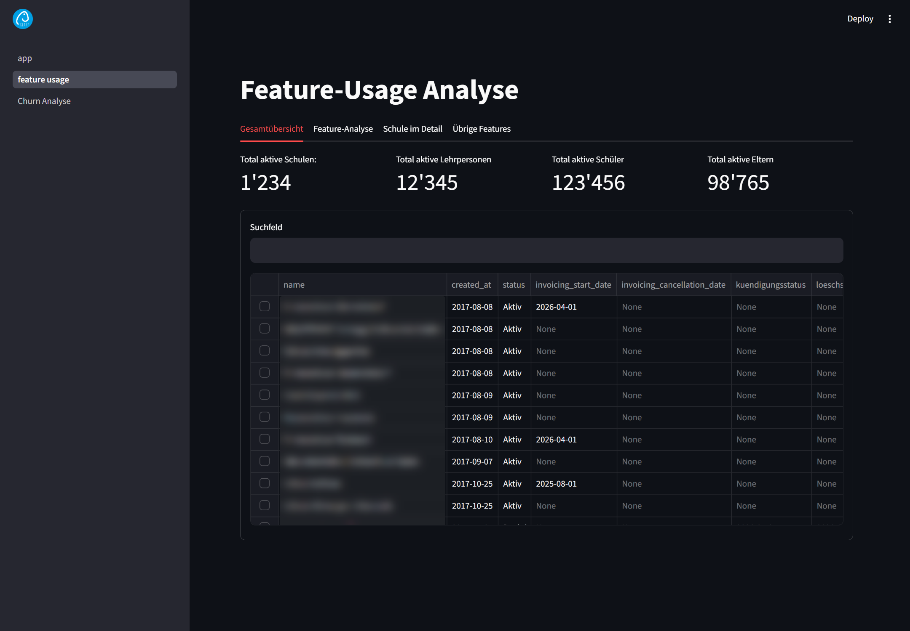
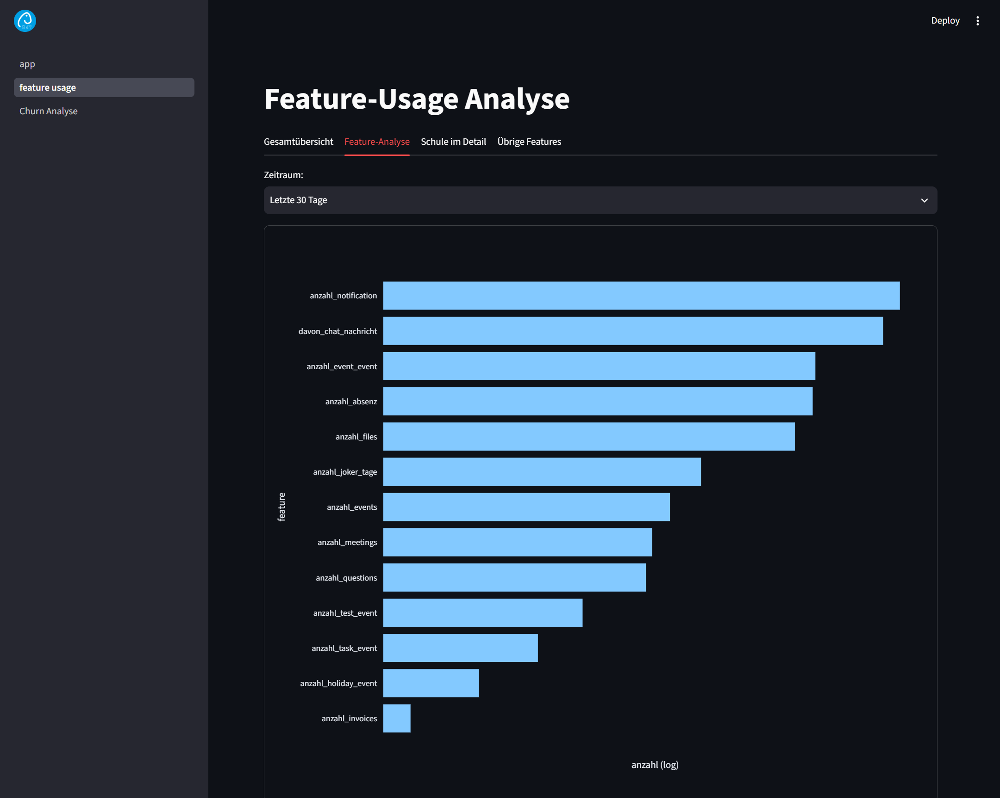
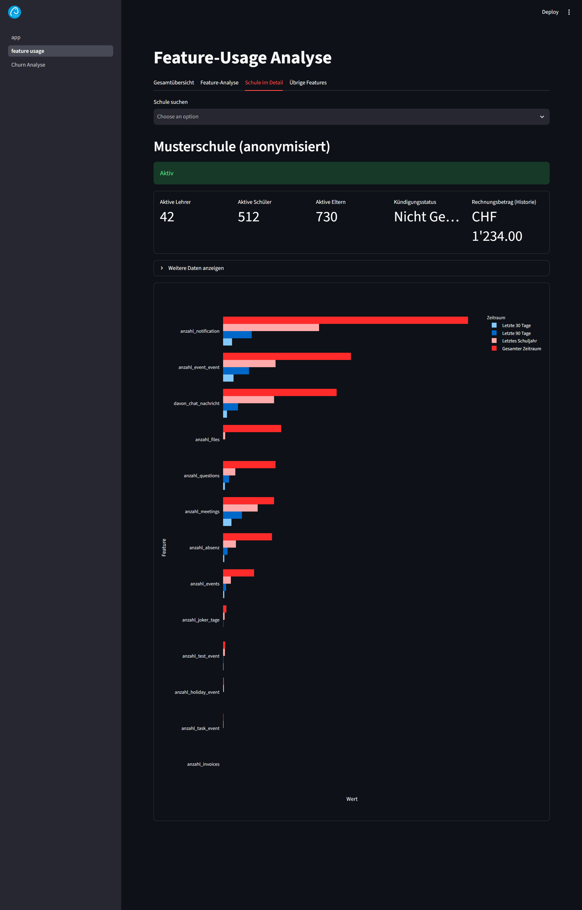
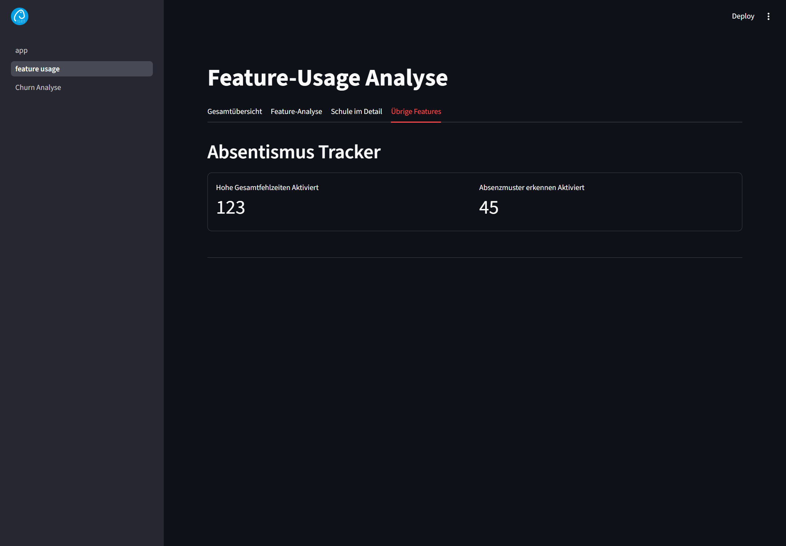
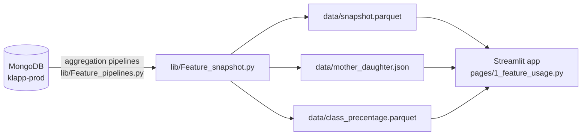

# Feature Usage Analysis

A Streamlit dashboard that shows **which Klapp features are used by which schools, and how heavily**: across all schools, per feature, and per individual school.
The data comes from precomputed snapshots of the `klapp-prod` MongoDB, so **no database connection is needed** just to view the dashboard.

> !IMPORTANT
> **All screenshots in this README are anonymized.
> - **School names** in the table are **blurred**.
> - The school name in the detail view is replaced with **"Musterschule (anonymisiert)"**.
> - **Key figures** (number of schools, teachers, students, parents, invoice amount, absenteeism counters) are **placeholder values** (e.g. `1'234`, `CHF 1'234.00`).
> - In the charts, **all value labels and axis numbers are hidden**. Only the bar proportions remain visible.
>
> Nothing in the images allows conclusions about a specific school or about real business figures.

---

## Contents

- [Features](#features)
- [Architecture](#architecture)
- [Project structure](#project-structure)
- [Installation](#installation)
- [Running the app](#running-the-app)
- [Refreshing the snapshot](#refreshing-the-snapshot)
- [Time windows](#time-windows)

---

## Features

The dashboard has four tabs. The UI itself is in German; tab names are given as shown in the app.

### 1. Gesamtübersicht (Overview)



- KPI tiles: active schools, teachers, students and parents (only schools with status *Aktiv*)
- Searchable table of all schools with creation date, status, invoicing start/cancellation, cancellation and deletion status, joker days and all `*_historie` metrics
- **Clicking a row** opens that school directly in the *Schule im Detail* tab

### 2. Feature-Analyse (Feature analysis)



- Total usage of each feature across all schools
- Selectable time window: *Letzte 30 Tage* (last 30 days), *Letzte 90 Tage* (last 90 days), *Letztes Schuljahr* (last school year), *Gesamter Zeitraum* (all time)
- Logarithmic x-axis, so rarely and heavily used features stay readable side by side

### 3. Schule im Detail (School detail)



- Pick a school from the dropdown or select it in the overview table
- Status (active / inactive), active teachers/students/parents, cancellation date, invoice total (all time)
- **Parent/child schools**: jump straight to the linked school (invoicing relationship from `mother_daughter.json`)
- Expandable section with further master data (creation, deletion status, joker days, invoicing period)
- Grouped bar chart: every feature across all four time windows, sorted by all-time usage

### 4. Übrige Features (Other features)



- **Absenteeism tracker**: number of schools that enabled the rules *Hohe Gesamtfehlzeiten* (high total absences) and *Absenzmuster erkennen* (detect absence patterns)

### Tracked metrics

| Metric | Source (collection) |
|---|---|
| `anzahl_notification`, `davon_chat_nachricht` | `notification` |
| `anzahl_event_event`, `anzahl_events`, `anzahl_meetings`, `anzahl_test_event`, `anzahl_holiday_event`, `anzahl_task_event` | `event` |
| `anzahl_absenz`, `anzahl_joker_tage` | `event` |
| `anzahl_files` | `file` |
| `anzahl_questions` | `question` |
| `anzahl_invoices` (invoice amount in CHF) | `invoices` |
| active teachers / students / parents | `school`, `user`, `student` |
| absenteeism rules, status, cancellation, deletion | `school` |

Each metric exists in four variants, with the suffixes `_30_tage`, `_90_tage`, `_letztes_schuljahr` and `_historie`.

---

## Architecture



1. **Snapshot** (`lib/Feature_snapshot.py`): runs all aggregation pipelines against MongoDB, merges the results per school (`_id`) and writes them to `data/` as Parquet/JSON.
2. **Dashboard** (`pages/1_feature_usage.py`): reads only those files, which keeps it fast and means it needs no database access.

---

## Project structure

```
.
├── app.py                     # Streamlit entry point (multipage)
├── pages/
│   └── 1_feature_usage.py     # The dashboard (4 tabs)
├── lib/
│   ├── Feature_pipelines.py   # MongoDB aggregation pipelines + time window definitions
│   ├── Feature_helpers.py     # DataFrame/pipeline helpers, Streamlit callbacks
│   └── Feature_snapshot.py    # Writes the snapshots to data/
├── data/                      # Snapshots (gitignored, real data!)
├── docs/                      # Anonymized screenshots + scripts that create them
├── logo/klapp_logo.png
├── notebooks/                 # Exploratory analyses (API, Graylog cross-check, ideas)
├── questions.md               # Open domain questions
└── requirements.txt
```

---

## Installation

Requires **Python 3.10+**. Creating new snapshots additionally requires access to the Klapp MongoDB.

```bash
python -m venv .venv
source .venv/bin/activate        # Windows: .venv\Scripts\Activate.ps1
pip install --upgrade pip
pip install -r requirements.txt
```

## Running the app

Always start from the project root, because the data paths (`data/...`) are relative to it:

```bash
streamlit run app.py
```

The dashboard is then available at <http://localhost:8501/feature_usage>.

> If `data/` contains no snapshots yet, the page fails on load. Create a snapshot first (see below) or get the files from someone on the team.

## Refreshing the snapshot

1. Copy `.env.example` to `.env` and fill in the connection string:

   ```bash
   cp .env.example .env
   ```

   ```dotenv
   mongo_uri=mongodb://...
   ```

   `.env` contains credentials and is excluded via `.gitignore`.

2. Create the snapshot. The script writes to `../data/`, so it must be run **from `lib/`**:

   ```bash
   cd lib
   python Feature_snapshot.py
   cd ..
   ```

   Output: `data/snapshot.parquet`, `data/mother_daughter.json`, `data/class_precentage.parquet`.

## Time windows

Defined in `lib/Feature_pipelines.py`, always relative to when the snapshot was created:

| Suffix | Meaning |
|---|---|
| `_30_tage` | last 30 days |
| `_90_tage` | last 90 days |
| `_letztes_schuljahr` | August 1 to July 20 of the most recently completed school year |
| `_historie` | all time |

